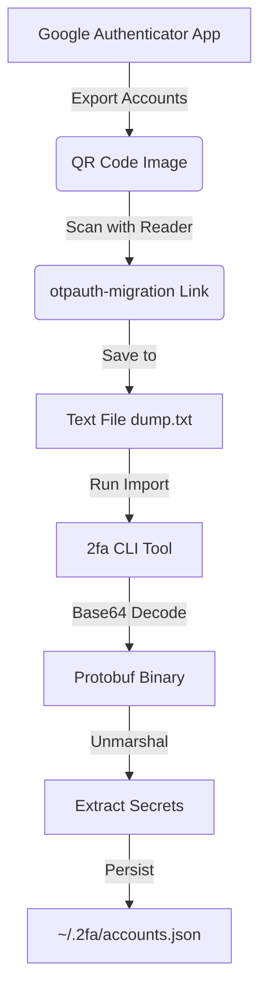
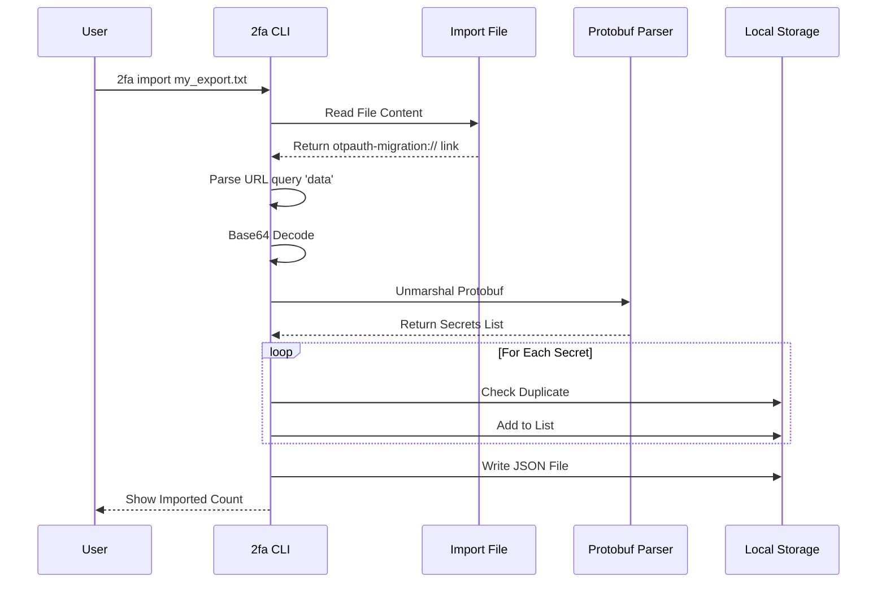

# 2fa (TOTP Authenticator)

`2fa` is a command-line 2FA/TOTP authenticator tool, fully compatible with Google Authenticator.

## Features

- **Google Import**: Supports importing accounts from Google Authenticator's export QR codes (`otpauth-migration://`).
- **Real-time**: Live countdown display in terminal with color indicators.
- **Search**: Fast fuzzy search for your accounts.
- **Management**: Add manual keys, delete accounts easily.

## Installation

```bash
go install github.com/ybcjcc/2fa@latest
```

## Usage

### 1. List Codes
Run without arguments to show all codes. The interface refreshes every 30s (conceptually).
```bash
2fa
# Account                        | Code       | Expires
# ----------------------------------------------------------------------
# Google:alice@gmail.com         | 123456     | 15 s
# GitHub:bob                     | 654321     | 15 s
```

### 2. Search
Filter by name or issuer.
```bash
2fa git
```

### 3. Import from Google Authenticator
1. In the Google Authenticator App: `Transfer accounts` -> `Export accounts`.
2. Use a QR scanner (e.g. WeChat, System Camera) to get the string starting with `otpauth-migration://...`.
3. If you have multiple QR codes, paste each link into a text file (one per line).
4. Run import:
```bash
2fa import my_export.txt
```

#### Import Mechanism



#### Processing Flow



### 4. Manual Add
```bash
2fa add -name "MyCheck" -secret "JBSWY3DPEHPK3PXP"
```

### 5. Delete
Fuzzy matches name to delete.
```bash
2fa del "MyCheck"
```

## Storage
Accounts are stored in `~/.2fa/accounts.json`. Keep this file safe!

## License
[MIT](LICENSE) © [ybcjcc](https://github.com/ybcjcc)
