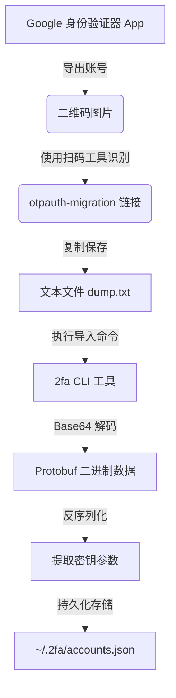
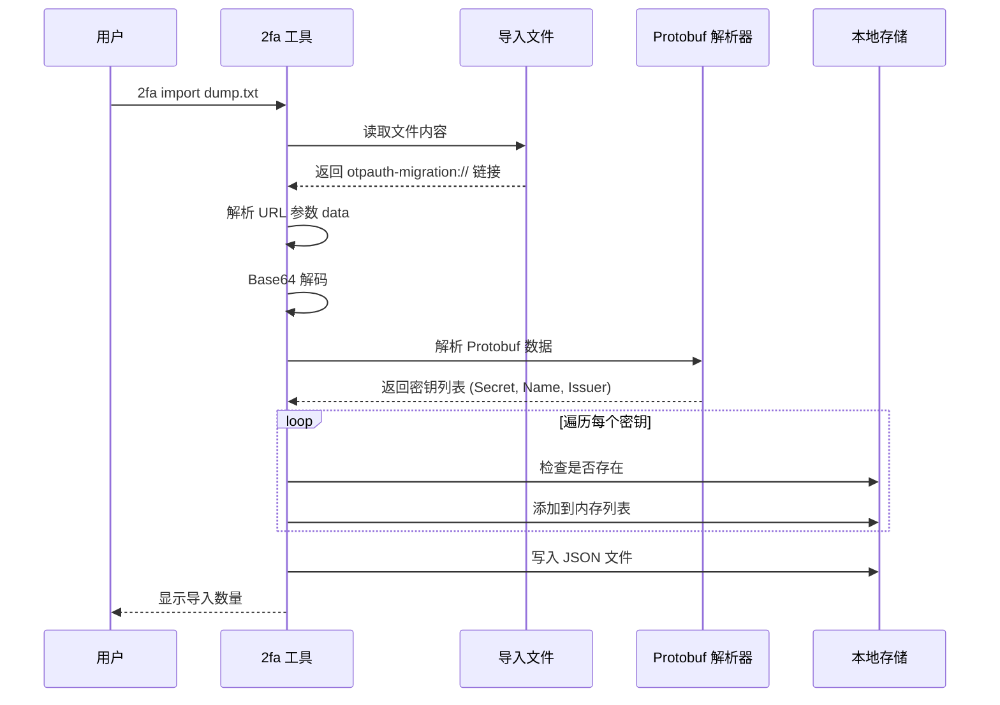

# 2fa (命令行验证器)

`2fa` 是一个轻量级的命令行 TOTP 两步验证工具，完全兼容 Google Authenticator。

## 主要功能

- **Google 导入**: 支持解析 Google 身份验证器导出的 `otpauth-migration://` 链接。
- **实时显示**: 终端内显示倒计时，带有绿/黄/红颜色提示。
- **快速搜索**: 支持模糊搜索账号。
- **账号管理**: 支持手动添加密钥、删除账号。

## 安装

```bash
go install github.com/ybcjcc/2fa@latest
```

## 使用指南

### 1. 查看验证码
直接运行不带参数。
```bash
2fa
# Account                        | Code       | Expires
# ----------------------------------------------------------------------
# Google:alice@gmail.com         | 123456     | 15 s
# GitHub:bob                     | 654321     | 15 s
```

### 2. 搜索
```bash
2fa git
# 仅显示名字包含 git 的账号
```

### 3. 从 Google Authenticator 导入
1. 在手机 App 中点击 "转移账号" -> "导出账号"。
2. 使用扫码工具（微信、相机等）扫描二维码，获取 `otpauth-migration://...` 开头的链接。
3. 如果有多个二维码，将每个链接复制到文本文件中（每行一个）。
4. 运行命令导入：
```bash
2fa import dump.txt
```

#### 导入原理图



#### 内部处理流程



### 4. 手动添加
```bash
2fa add -name "MyServer" -secret "JBSWY3DPEHPK3PXP"
```

### 5. 删除账号
支持模糊匹配名称删除。
```bash
2fa del "MyServer"
```

## 数据存储
所有账号信息以 JSON 格式存储在 `~/.2fa/accounts.json` 文件中。请妥善保管此文件。

## 许可证
[MIT](LICENSE) © [ybcjcc](https://github.com/ybcjcc)
